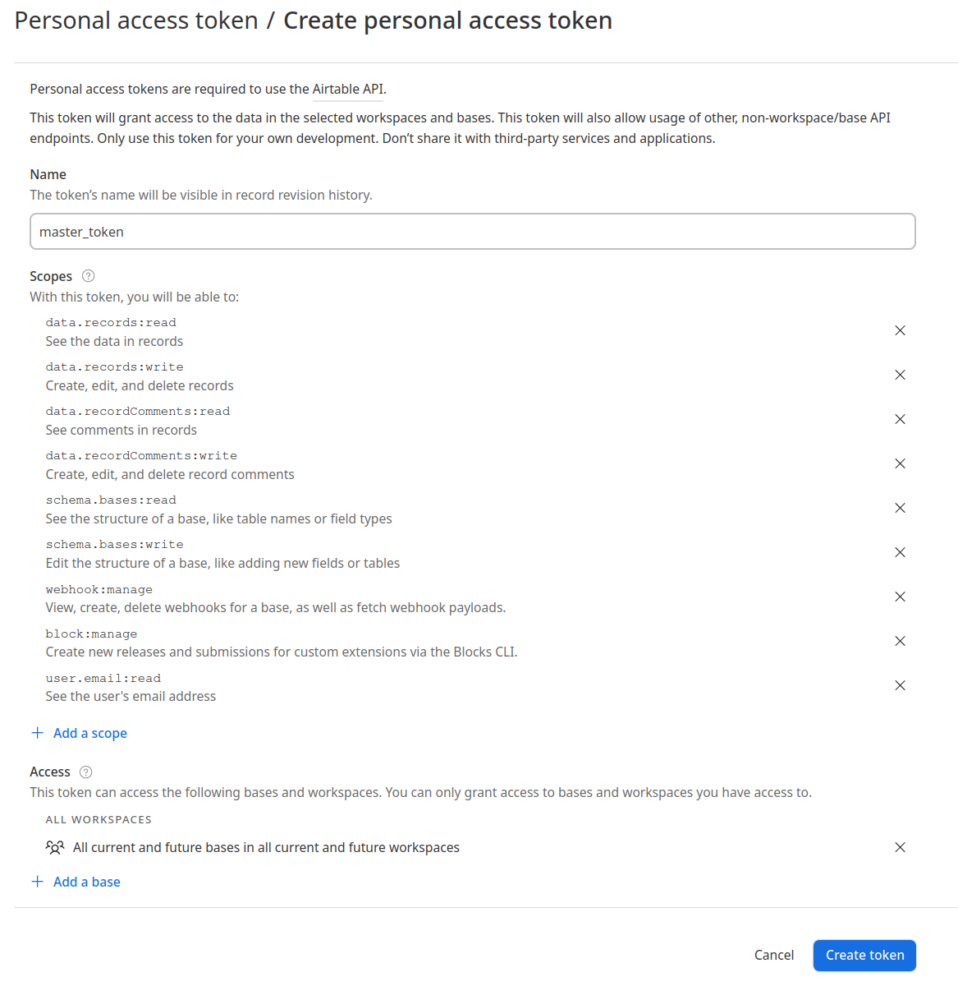
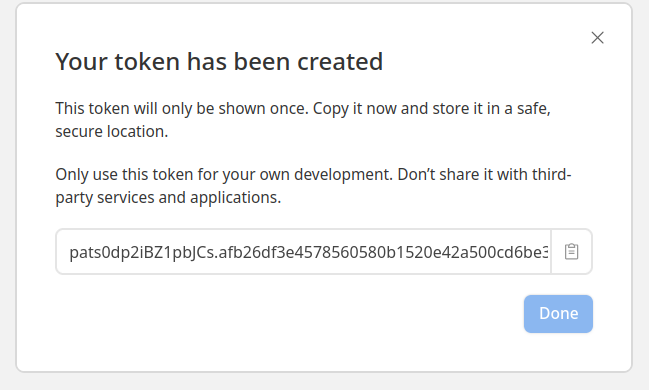

<h1>Setup</h1>

<h2>Setting Up AirTable</h2>
1. You will need to create an AirTable account to store the information, it is completely free, go to https://www.airtable.com/ and click 'Sign up for free'

2. If you have a Google account you can quickly create an AirTable account by clicking on 'Continue with Google', otherwise create the account manually

3. Once signed in, go to https://airtable.com/create/tokens and create a PAT (personal access token). For convenience, I named mine master_token and selected all of the scopes and allow it access to all workspaces. If you are sensitive about security, please only select the features you plan to use

4. You will receive a pop-up with a token value, copy and store it somewhere securely. I will reference this as <b>pat_token</b> below
   
