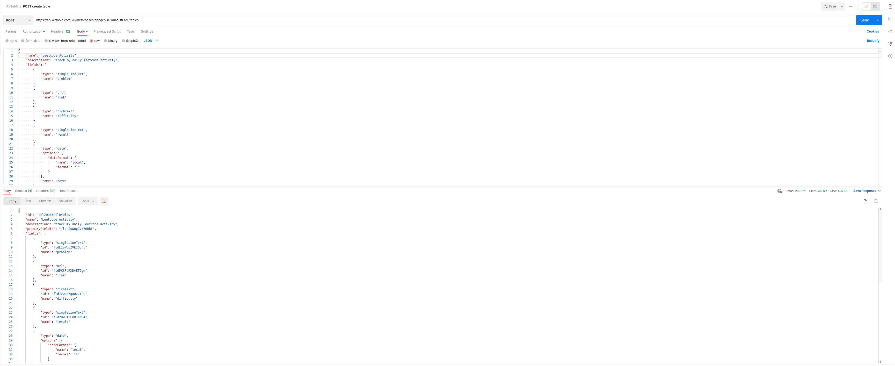
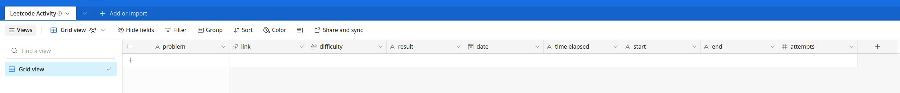

<h1>Setup</h1>

<h2>Setting Up AirTable</h2>

1. You will need to create an AirTable account to store the information, it is completely free, go to https://www.airtable.com/ and click 'Sign up for free'

1. If you have a Google account you can quickly create an AirTable account by clicking on 'Continue with Google', otherwise create the account manually

1. Once signed in, go to https://airtable.com/create/tokens and create a PAT (personal access token). For convenience, I named mine master_token and selected all of the scopes and allow it access to all workspaces. If you are sensitive about security, please only select the features you plan to use

   

4. You will receive a pop-up with a token value, copy and store it somewhere securely. I will reference this as <b>pat_token</b> later

   

5. Create a base in AirTable; a base is similar to a database, in a base you work with one or more tables, each table appears as a tab on the page

6. On the base page, find the URL and copy the alphanumeric string right after https://airtable.com/, it should be prefixed with <b>app</b>, this value will be referenced as <b>base_id</b>

7. Edit the create-leetcode-table.sh file, replace <b>{baseId}</b> with your <b>base_id</b> and replace <b>YOUR_TOKEN</b> with <b>pat_token</b>. If you can execute bash locally, in this directory run command <b>./create-leetcode-table.sh</b>, alternatively you can import the command into Postman and run it from there

   

8. If successful, refresh the AirTable Base page and you should find a table called <b>LeetCode Activity</b> that looks like this:

9. If you made it here you have completed AirTable setup!
